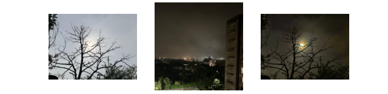

# image_daytime_replacement
A short tool, to change the daylight of the image based on choice of user - day, night, or evening

## Usage
```sh
 python .\change_daytime.py -i .\input.jpg -d night --plot
```

Night


Evening


## Further Options
```sh
python .\change_daytime.py -h                            
usage: change_daytime.py [-h] [--input INPUT] [--reference REFERENCE] [--output OUTPUT]
  [--new_daytime NEW_DAYTIME] [--root_folder ROOT_FOLDER] [--plot]

Change image colors based on the time of day.

options:
  -h, --help            show this help message and exit
  --input INPUT, -i INPUT
                        Path to the input image
  --reference REFERENCE, -ref REFERENCE
                        Reference image or data for color adjustment
  --output OUTPUT, -o OUTPUT
                        Path to save the output image
  --new_daytime NEW_DAYTIME, -d NEW_DAYTIME
                        Specify the new time of day (e.g., "morning", "afternoon", "evening", "night")
  --root_folder ROOT_FOLDER, -root ROOT_FOLDER
                        Root folder for assets
  --plot                Flag to plot and visualize the image after processing
```